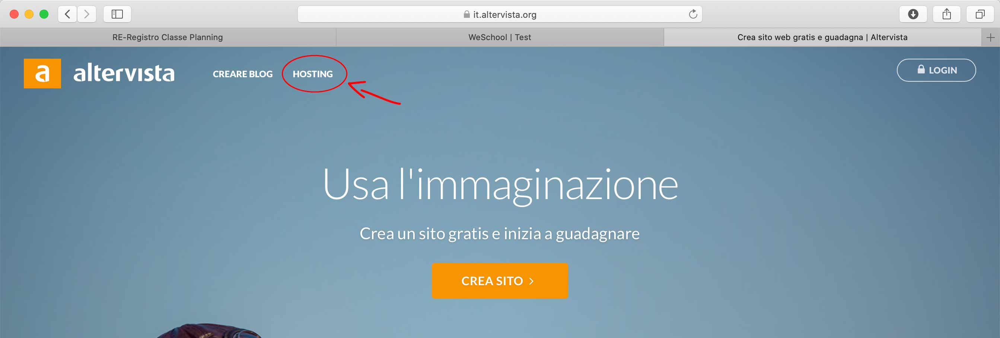
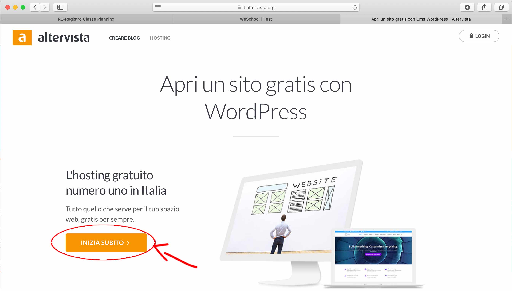
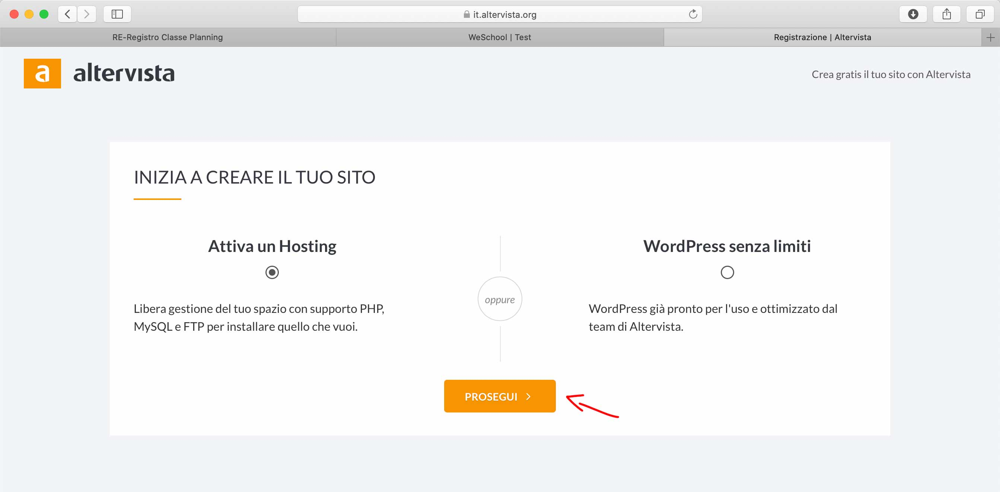
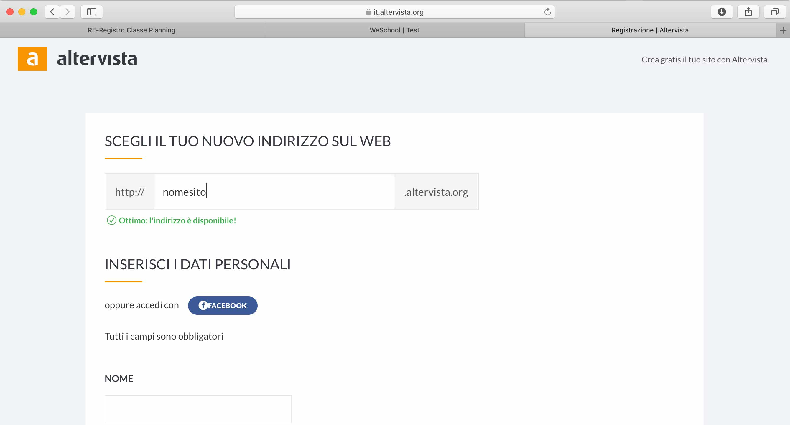
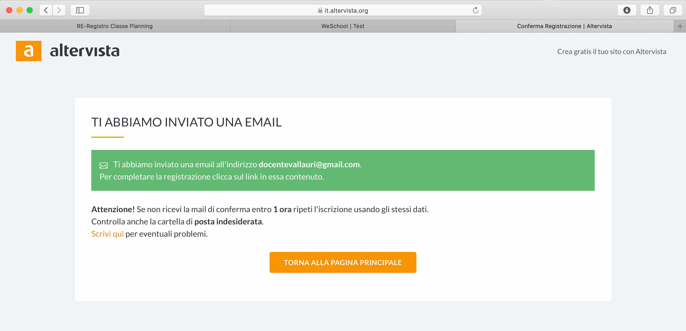
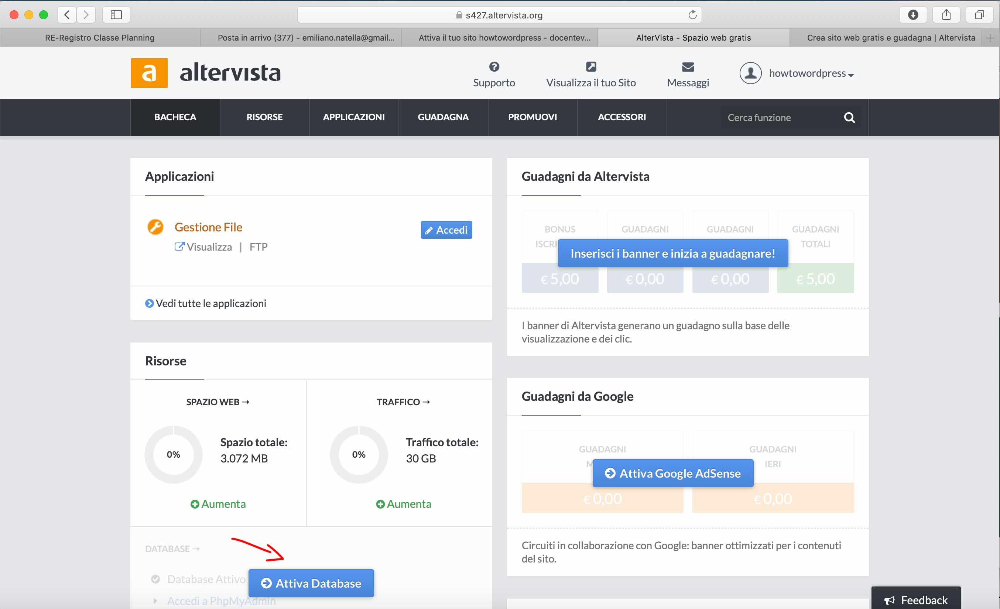
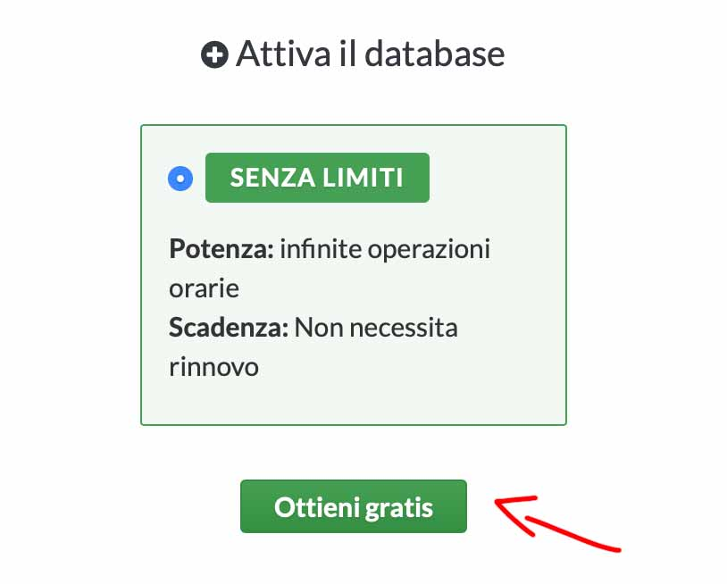
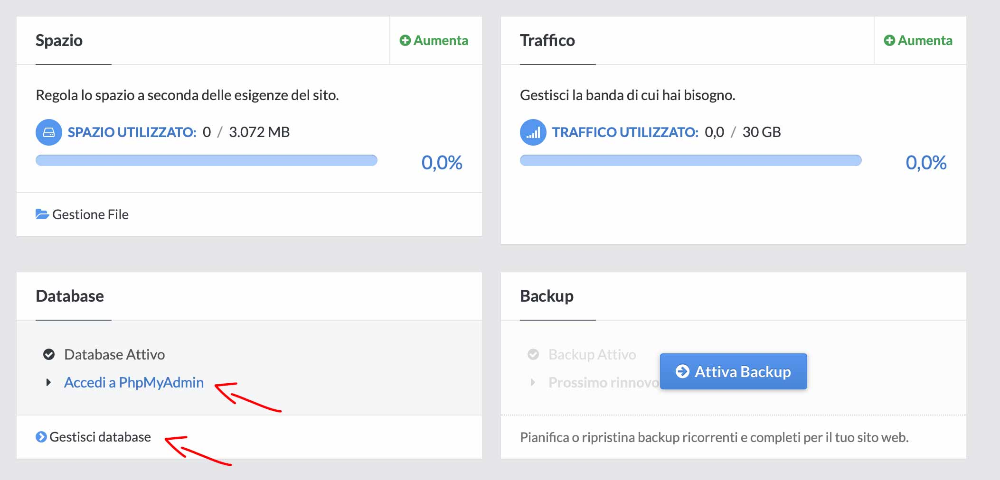
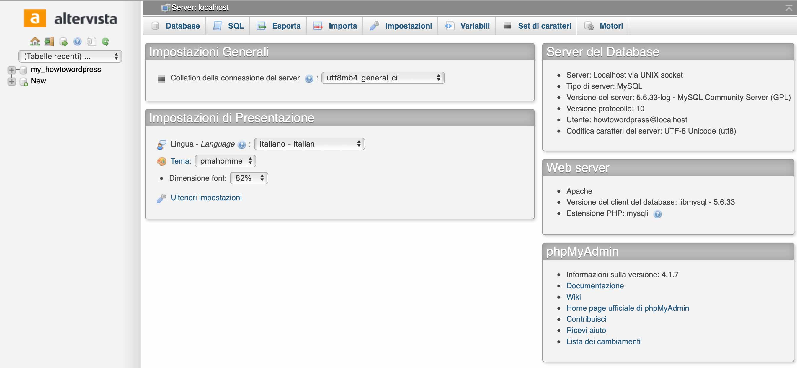
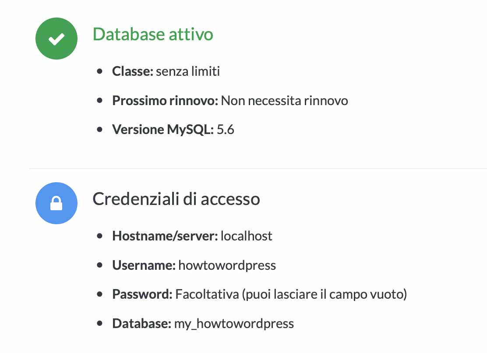

## Installazione wordpress su altervista

### Registrazione su altervista

1. Andare su altervista.org

2. Cliccare su HOSTING

   

   

3. Continuare la registrazione

   

   

4. Proseguire 
   Mi raccomando lascia selezionata l'impostazione **Attiva un Hosting**, se dovessi scegliere come impostazione **Wordpress senza limiti** attiverai l'installazione automatica che no ti darà accesso a tutti i file del CMS e nemmeno del database, ma solo all'area backend. 

   

   

   

5. Compila tutti i campi

   Inserisci il nome del sito che intendi registrare. 
   Se ad esempio scegliessi come nome "vallauri" la URL per accedere al sito sarebbe es. http://vallauri.altervista.org

   "valauri" è un sottodominio o dominio di [terzo livello](https://it.wikipedia.org/wiki/Sottodominio)

   Se volessimo registrare un dominio senza l'aggiunta del parola `.altervista.org` dovremmo passare a delle soluzioni a pagamento.

   Compila anche tutti gli altri dati 

   

   

6. Una volta compilato tutti i campi ed inserita una mail valida avrai completato la registrazione.

   Riceverai una mail di attivazione dell'account ed un'altra con le credenziali di accesso all'hosting.

   

   

7. La tua registrazione e completata e la bacheca di altervista appare così.

   Per poter installare wordpress però abbiamo bisogno di un database, pertanto dovremo attivarlo dal pannello di altervista

   

   

8. Conferma l'attivazione

   

9. Adesso sulla bacheca noterai che hai attivato il database. Da qui potrai accedere sia al pannello di PhpMyAdmin (per ora non toccare niente in quest'area) che ai parametri di configurazione del database "Gestisci database".

   

   

   Pannello PhpMyAdmin

   

   

   Parametri per la **connessione al database**, ci serviranno poi per installare **wordpress**:

   - Hostname: è l'indirizzo dell'host server del database, in questo caso è localhost
   - username: lo username dell'amministratore
   - Password: password amministratore, in questo caso è vuoto e lasciatelo così visto che stiamo sperimentando per motivi didattici e che non dobbiamo proteggere dati sensibili
   - Database: è il nome del database

   