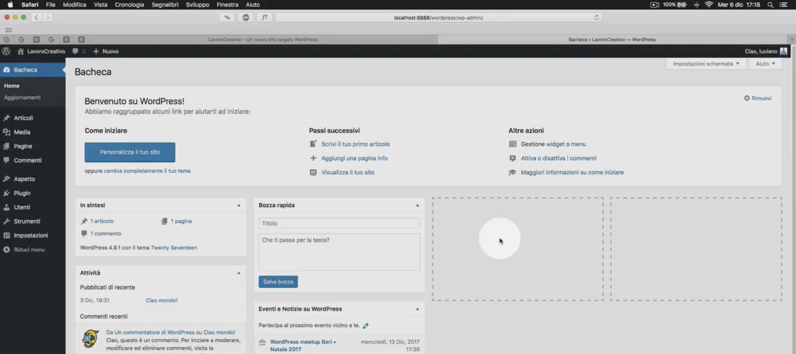

## Lavoro svolto fin'ora in laboratorio

Per ripetere gli argomenti trattati fin'ora in laboratorio ho creato questa repository e vi posto anche del materiale video

Abbiamo visto cos'è wordpress, cos'è un servizio di hosting, come configurare i parametri per la connessione al database

#### Pre-configurazione
1. Attivazione hosting
2. Attivazione database per connessione al CMS
3. Installazione wordpress

#### Wordpress
- Panoramica sulla bacheca
   

- Gestione articoli
   
    - Creazione/modifica cancellazione articoli
    - Tassonomie: Differenza tra categorie e tag e gestione su wordpress
- Gestione del menu
   

- Le impostazione generali di wordpress
  
