### Installazione wordpress su altervista

1. Apri una nuova scheda del browser e scarica l'ultima versione di wordpress, vai su www.wordpress.org e clicca su Get Wordpress

    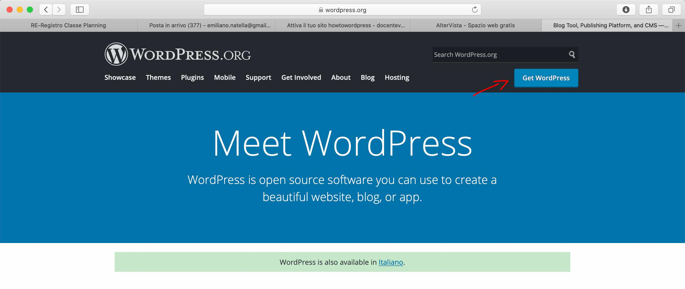

    

    Nota la sezione dei **Requirements**, sono i requisiti minimi consigliati che dovrà avere il tuo hosting. Clicca su download

    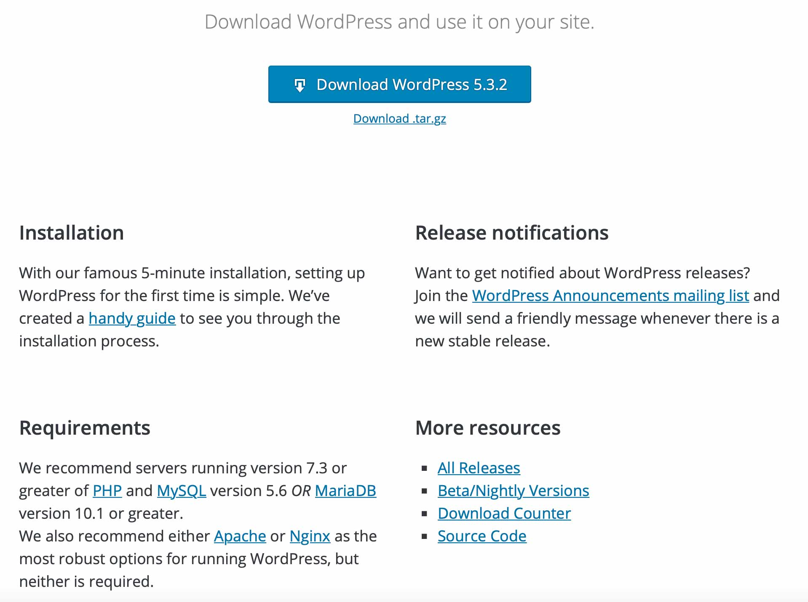

    

2. Adesso torna sulla bacheca di altervista (ricorda che le credenziali le trovi sulla mail) e clicca sull'area di **gestione file** che serve appunto per caricare i file sul tuo spazio web. Da qui dovremmo fare l'upload di wordpress

    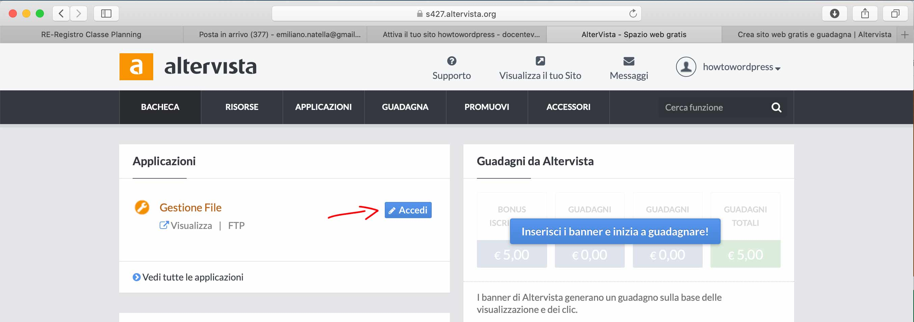

    

    Al momento c'è soltanto un file html di nome `index.html` che ha generato altervista. Clicca su invia file per caricare wordpress

    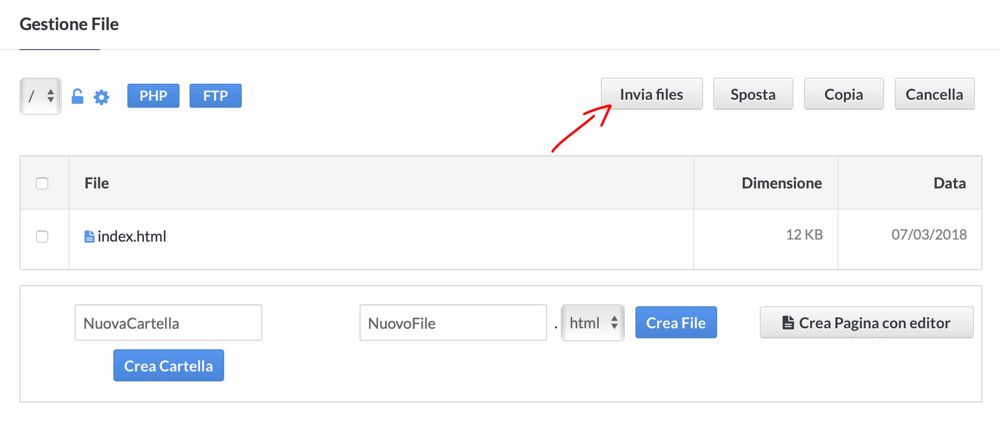

    

    Wordpress è stato scaricato come archivio compresso (.zip) e con altervista come con altri servizi di hosting abbiamo la possibilità di fare l'upload di un file compresso senza dover necessariamente decomprimere il file prima del caricamento. Clicca su Invia archivi compressi

    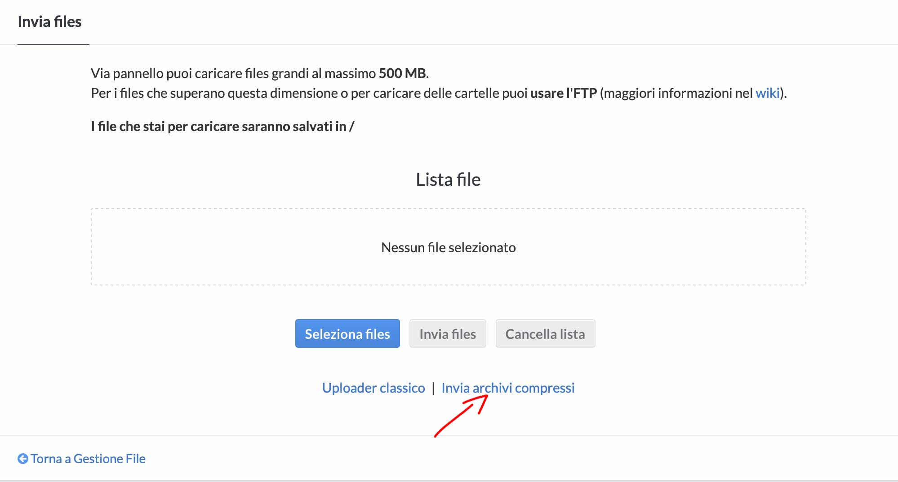

    

    Una volta confermato e completato l'upload dovresti avere una cartella wordpress tra i tuoi file. Prima di procedere all'installazione di wordpress se vuoi puoi cambiare il nome della cartella. Il tuo sito wordpress sarà accessibile tramite questa cartella attraverso la URL www.nomedominio.altervista.org/wordpress/

    Se vuoi installare wordpress sulla root principale di altervista allora sposta tutto il contenuto della cartella wordpress dove si trova il file index.html, ma cancella o rinomina quest'ultimo ad es. indexOLD.html. 

    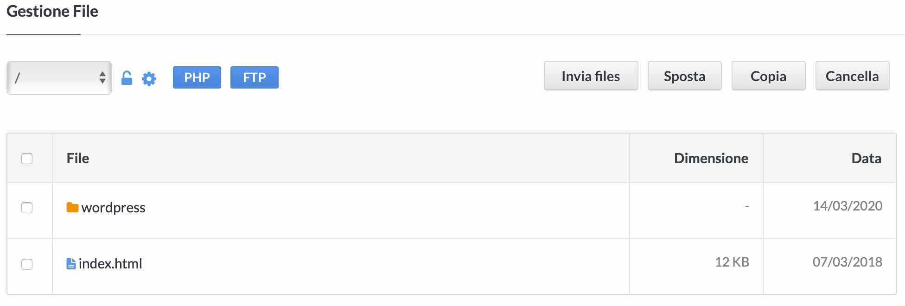

    

    Il  sito sarà accessibile da qui

    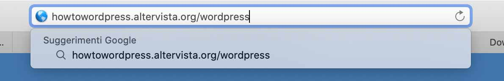

    

    Adesso se tutto è andato bene, ti dovrebbe apparire una schermata che ti permette l'installazione guidata di wordpress

    

    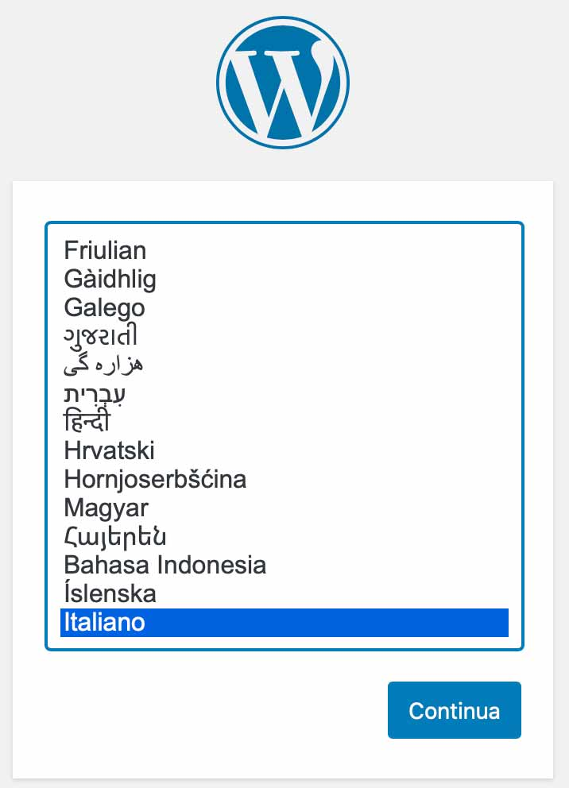

    Vai avanti 

    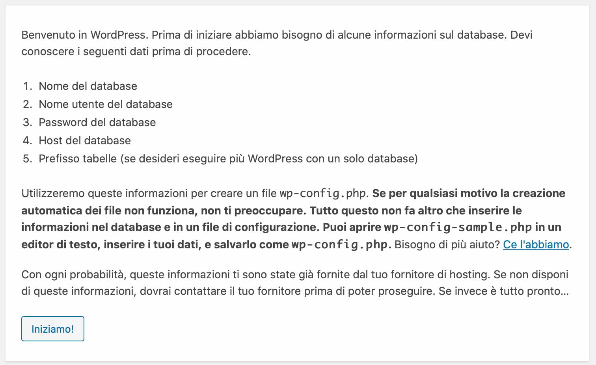

    

    In questa sezione dovrai inserire i parametri di connessione al database presenti sul pannello di altervista. Prefisso tabella lascia pure `wp_`

    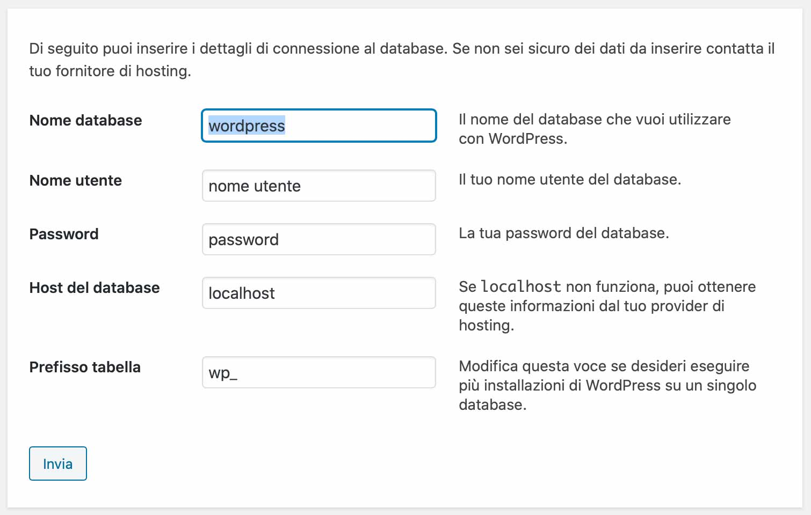

    

    Dopo aver inserito i parametri di connessione al db andando avanti ti chiede di inserire le informazioni relative a wordpress. Mi raccomando inserisci una mail valida perchè ti servirà in futuro

    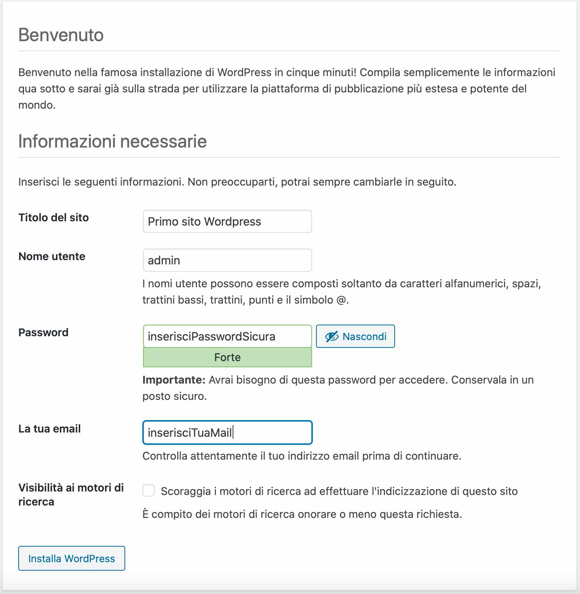
    
    
    
    Installazione completata
    

